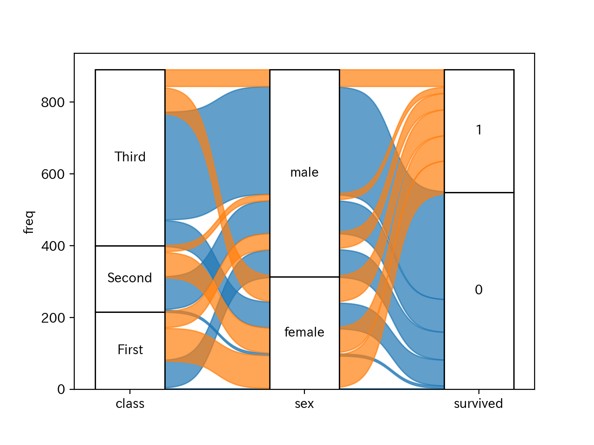

# pyalluvial
This is a python package to draw an alluvial plot.  
This package is influenced by [ggalluvial](https://cran.r-project.org/web/packages/ggalluvial/vignettes/ggalluvial.html)  

# Installation
```
pip install pyalluvial
```
# Usage
```python
# For example using titanic data
import pyalluvial.alluvial as alluvial
import seaborn as sns # for downloading titanic dataset

titanic = sns.load_dataset('titanic')
# create wide format dataframe
titanic['freq'] = 1
wide_df = titanic[['survived', 'class', 'sex', 'freq']].groupby(['survived', 'class', 'sex'], as_index=False).sum()

#draw alluvial plot
fig = alluvial.plot(df=wide_df, xaxis_names=['class', 'sex', 'survived'], y_name='freq', alluvium='survived')
```

# More Infomations (in Japanese)
https://note.com/nekoumei/n/n2e4d39129afc
